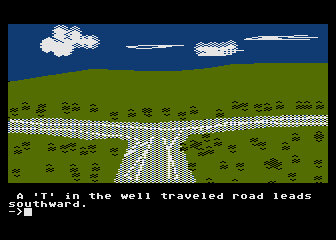

# 09. Coin Flip

## 🎯 Topic: Control Flow

So far, every Python program we've encountered has only had one path of execution — they all execute one line at a time, from top to bottom. Every time you run them, it gives you the same result.

But what if we want our program to do different things depending on conditions?

Control Flow lets us do that. ✨

### 🛣️ Real-Life Analogy

It's like going down a highway and reaching a fork with a sign that says:

> **Albuquerque: left. Phoenix: right.**

You choose a path based on your destination — just like your program chooses a path based on logic!

> *"A ‘Y’ in the well traveled road leads southward."*

---

### 🧠 What You’ll Learn

In this **Control Flow** chapter, you’ll explore how programs “make decisions” using:

- `if`, `elif`, and `else`
- Comparison operators (`==`, `!=`, `>`, `<`, etc.)
- Boolean logic (`and`, `or`, `not`)

Let’s start introducing real decision-making power into our Python code! 💻🧠
