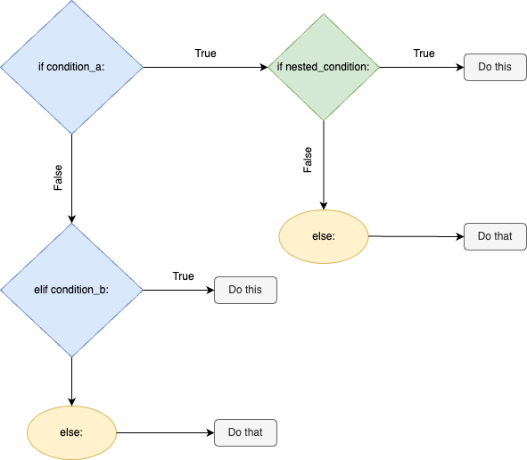

Nested If Statements
# Syntax
As our program gets longer and more complex, so does the decision-making of our code. You might've already run into situations where you want to check for another condition after a condition is true.

You know what else we can do with if/elif/else statements?

We can nest them inside one another! 🪹

A nested if statement is an if statement inside another if statement.

Suppose we have a simple if/else statement:

if age >= 18:
  print('You are old enough to apply for a loan.')
else:
  print('You are too young to apply for a loan.')

Let's add anotherif/else statement nested inside the outer if statement:

if age >= 18:
  if income >= 20000:
    print('You are eligible for a loan.')
  else:
    print('Your income is too low to be eligible for a loan.')
else:
  print('You are too young to apply for a loan.')

In Python, indentation is the only way to determine the nesting level. Because lines 2-5 are indented more, it's inside the outer if statement.

Here's the control flow of the program:

nested if statements

Note: Be warned, though. Nesting these statements too deeply (past 2-3 levels) is generally not a good idea, as this might make your program challenging to read.

# Example
The following example illustrates how nested control flow statements can affect the output of a program:

weather = 'Sunny'
humidity = 35

if weather == 'Sunny':
  if humidity < 60:
    print('Let’s go to the beach! 🏖️')
  else:
    print('Hmmm, it’s a little humid for a beach day.')
else:
  print('It’s not sunny today... let’s try for another day.')

This will print the following:

Let's go to the beach! 🏖️

If the humidity is 65, then the output would be:

Hmmm, it's a little humid for a beach day.

Now you can add layers of decision-making to your programs!
