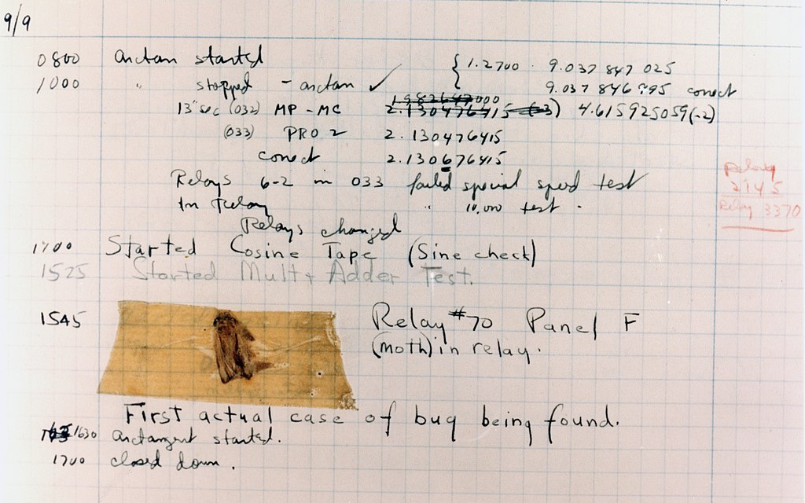

# Errors in Python  
## 🦋 The Moth and the Myth

The legend goes that on **September 9th, 1947**, a team of computer scientists at Harvard University found a moth trapped in the Harvard Mark II computer’s logbook. One of the team members was the computer science pioneer **Grace Hopper** and she reported the bug and wrote:

> “First actual case of bug being found.”

Some also argue that the term “bug”, meaning technical error, dates back to **1878** with **Thomas Edison**. 🐛



> Notes by Grace Hopper that include the first actual bug found in a computer system that wasn't working properly.

---

By this point in the journey, you may have encountered an error or two when running the code.

Here are some common Python errors:

- `SyntaxError`: occurs when invalid Python code is present.  
- `NameError`: occurs when you're trying to use a variable without declaring it first.  
- `TypeError`: occurs when the data type you're using doesn't suit what you're trying to do.  

During your coding adventure, you are destined to encounter many annoying lil' red errors.  
But what makes a programmer great isn’t avoiding errors, but knowing how to face them head-on and resolve them. 💪

---

Let's explore these below!


## 🔠 SyntaxError

One of the most common errors is the `SyntaxError`, which occurs when you try to run code that is not valid Python – such as a misspelled keyword, a missing colon `:`, or a missing closing parenthesis.

```python
print(Hello, World!
# SyntaxError: invalid syntax
```

The snippet above will throw a `SyntaxError` when run because the `print()` function requires a closing parenthesis. Also, `'Hello, World!'` should be surrounded by quotes.

Full error message might look like:

```
  File "main.py", line 1
    print(Hello, World!
                      ^
SyntaxError: invalid syntax
```

- `"File main.py, line 1"`: shows the file name and line number  
- `^` arrow points to where the error was detected  
- ⚠️ Note: Sometimes the error is before the pointer!

---

## 🧾 NameError

Occurs when you're trying to refer to a variable that hasn’t been defined yet – likely due to a typo or missing definition.

```python
print(greetings)
# NameError: name 'greetings' is not defined
```

Fix it like this:

```python
greetings = 'Howdy 🤠'
print(greetings)
# Output: Howdy 🤠
```

---

## 🔢 TypeError

This occurs when you're using incompatible data types together.

```python
message = 'The air quality is '
print(message + 28)
# TypeError: can only concatenate str (not "int") to str
```

Fix:

```python
message = 'The air quality is '
print(message + str(28))
# Output: The air quality is 28
```

---

## 📘 Documentation Tip

If you run into an error that’s not listed here, check the official Python docs or paste your error message into Google.

---

# 🐞 Bonus: Bug Catcher 🔎

Here’s a program with bugs:

```python
butterflies = 10
beetles = 12
ladybugs = 20

print('I caught ' + butterflies + ' 🦋 butterflies!')
print('I caught ' + beetles + ' 🪲 beetles!')
print('I caught ' + ladybug + ' 🐞 ladybugs!')

print('I caught ' + str(total) + ' total bugs!'
```

Copy this into a Python editor and run it.

👀 Oh no! Errors! Can you find and fix them?

---

### 🧠 Debugging Tip

- Don’t panic when you see a bunch of error messages.
- Always start from the **first** (topmost) error.
- Use `#` to comment out lines and isolate issues.
- Use the **process of elimination**.

---

**Happy debugging! 🕵🏻**

— *Codédex*
